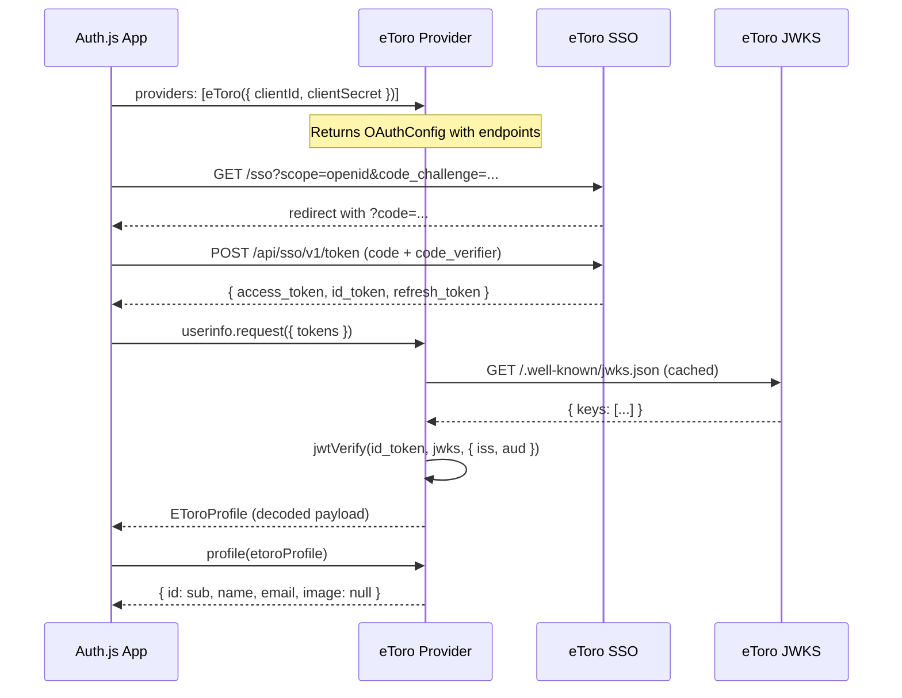

## Overview

Build and publish `authjs-etoro` — a TypeScript-native eToro SSO provider for Auth.js (next-auth v5 / @auth/core).

Auth.js providers are functions that return an `OAuthConfig<Profile>` object. This package exports a default `eToro(options)` function matching exactly that shape — the same way built-in providers like GitHub and Google work. Drop it into `providers: [eToro({ clientId, clientSecret })]` and Auth.js handles the rest.

**The core challenge:** eToro has no `/userinfo` endpoint. User identity lives in the `sub` claim of the id_token returned at the token exchange step. The `userinfo` config must use a custom `request` function that:
1. Extracts `id_token` from the token response
2. Validates it via JWKS (`https://www.etoro.com/.well-known/jwks.json`)
3. Returns the decoded payload as the profile

**Key references:**
- Auth.js provider shape: `OAuthConfig
` from `@auth/core/providers`
- Built-in provider example: `@auth/core/providers/github` — follow this structure exactly
- JWKS validation: reuse the same pattern as `passport-etoro` and `better-auth-etoro` (both already in this workspace)
- Auth.js callback URL convention: `/api/auth/callback/etoro`
- Auth.js requires `checks: ['pkce', 'state']` for PKCE

## Research Notes

### Auth.js Provider Contract
- A provider is a function `eToro(options: OAuthUserConfig
) => OAuthConfig
`
- `OAuthConfig
` = `OIDCConfig
 | OAuth2Config
` from `@auth/core/providers`
- Key fields: `id`, `name`, `type`, `authorization`, `token`, `userinfo`, `profile`, `checks`
- `userinfo.request` receives `{ tokens, provider }` — must return an object (the profile)
- `profile(profile, tokens)` maps provider profile → Auth.js `User` (`{ id, name, email, image }`)
- The `id` returned from `profile()` becomes `account.providerAccountId`
- Import types from `@auth/core/providers` (re-exports from `@auth/core/providers/oauth`)

### eToro JWKS Validation (from passport-etoro + better-auth-etoro)
- Both use `jose`: `createRemoteJWKSet(new URL(JWKS_URL))` + `jwtVerify(token, jwks, { issuer, audience })`
- passport-etoro: singleton JWKS with 1h TTL refresh, `_resetCache()` for testing
- better-auth-etoro: `Map<url, RemoteJWKSet>` cache, `_resetJWKS()` for testing, `clockTolerance: 120`, `algorithms: ["RS256"]`
- For this library: use Map-based cache (cleaner), expose `_resetCache()` for testing
- Profile type from better-auth-etoro: `sub`, `iss`, `aud`, `iat`, `exp`, `given_name?`, `family_name?`, `email?`, `email_verified?`

### eToro SSO Endpoints (confirmed in both libraries)
- Authorization: `https://www.etoro.com/sso`
- Token: `https://www.etoro.com/api/sso/v1/token`
- JWKS: `https://www.etoro.com/.well-known/jwks.json`
- Issuer: `https://www.etoro.com`
- Access token lifetime: 10 minutes
- Refresh token lifetime: 30 days (rotating)

## Assumptions
- `@auth/core >= 0.18.0` is stable enough that `OAuthConfig`, `OAuthUserConfig` types won't change
- eToro id_tokens are RS256-signed JWTs (confirmed by both reference libraries)
- The `name` field in the scope's profile mapping should use `given_name` + `family_name` from the id_token when available

## Architecture Diagram

```mermaid
graph TD
    subgraph "authjs-etoro package"
        A[src/index.ts<br/>default export: eToro&#40;&#41;<br/>named: validateIdToken, EToroProfile, _resetCache]
        B[src/validate.ts<br/>validateIdToken&#40;&#41;<br/>JWKS cache + jwtVerify]
        C[src/types.ts<br/>EToroProfile interface]
    end

    subgraph "Build Output"
        D[dist/index.js ESM]
        E[dist/index.cjs CJS]
        F[dist/index.d.ts types]
        G[dist/index.d.cts CJS types]
    end

    subgraph "External"
        H["@auth/core (peer dep)"]
        I["jose (runtime dep)"]
        J["eToro JWKS endpoint"]
    end

    A --> B
    A --> C
    B --> C
    B --> I
    I --> J
    A --> H

    A --> D
    A --> E
    A --> F
    A --> G
```

## One-Week Decision

**YES** — This is a focused npm library with ~3 source files, well-defined types, and an established pattern from two reference implementations. A single developer can complete this in 1-2 days.

Rationale:
- Small surface area: 3 source files (types, validate, index)
- Clear contract: Auth.js provider shape is well-documented
- JWKS validation is copy-adapted from existing libraries
- Test suite is straightforward with msw mocking
- No UI, no database, no deployment complexity

## Implementation Plan

### Phase 1: Project Scaffolding
- Create `package.json` with correct deps, peer deps, exports map, files, engines
- Create `tsconfig.json` (strict mode, ESM)
- Create `tsup.config.ts` (dual ESM + CJS build)
- Create `vitest.config.ts` with coverage thresholds
- Create `.gitignore` (update existing)

### Phase 2: Source Code
- `src/types.ts` — `EToroProfile` interface
- `src/validate.ts` — `validateIdToken()`, JWKS cache, `_resetCache()`, constants
- `src/index.ts` — default export `eToro()` provider factory, re-exports

### Phase 3: Test Suite
- `test/helpers.ts` — JWT signing helpers (generate RS256 keys, sign tokens)
- `test/setup.ts` — msw server setup for JWKS endpoint
- `test/validate.test.ts` — validateIdToken tests (valid, expired, wrong-iss, wrong-aud, invalid sig, cache)
- `test/index.test.ts` — provider shape tests, userinfo.request tests, profile mapping

### Phase 4: README
- Install instructions
- Next.js App Router quickstart
- SvelteKit quickstart
- Astro quickstart
- Callback URL reference
- Token lifetime table
- Security checklist

### Phase 5: Verification
- `npm run build` — dual build passes
- `npm run test` — 100% branch coverage
- `npm pack --dry-run` — only dist + README in tarball
- `tsc --noEmit` — no type errors

## Acceptance Criteria

- [ ] Default export `eToro(options: OAuthUserConfig<EToroProfile>): OAuthConfig<EToroProfile>`
- [ ] `provider.id === 'etoro'`
- [ ] `provider.name === 'eToro'`
- [ ] `provider.type === 'oidc'`
- [ ] `provider.authorization` points to `https://www.etoro.com/sso` with `scope: 'openid'`
- [ ] `provider.token` points to `https://www.etoro.com/api/sso/v1/token`
- [ ] `provider.userinfo.request` validates the id_token via JWKS and returns profile
- [ ] `provider.profile(profile)` returns `{ id: profile.sub, name: profile.name ?? null, email: profile.email ?? null, image: null }`
- [ ] `provider.checks` includes `'pkce'` and `'state'`
- [ ] Named export `validateIdToken(idToken: string, clientId: string): Promise<EToroProfile>` for advanced use
- [ ] `EToroProfile` interface exported with at minimum: `sub`, `iss`, `aud`, `iat`, `exp`, optional `name`, `email`
- [ ] TypeScript strict mode, no type errors
- [ ] Dual ESM + CJS build via tsup with `.d.ts` / `.d.cts`
- [ ] `peerDependencies: { "@auth/core": ">=0.18.0" }`, `dependencies: { "jose": "^5.0.0" }`
- [ ] Vitest tests with msw JWKS mocking — 100% branch coverage:
  - `eToro()` returns correct shape
  - `userinfo.request` returns profile for valid id_token
  - `userinfo.request` returns null/throws for missing id_token
  - `userinfo.request` throws for invalid JWT signature
  - `profile()` mapping
  - `validateIdToken` valid/invalid/expired/wrong-iss/wrong-aud cases
  - JWKS cache hit (second call reuses cache)
  - `_resetCache()` works
- [ ] `package.json` has `files: ["dist", "README.md"]`, correct `exports` map
- [ ] `npm pack --dry-run` clean — no src, tests, coverage in tarball
- [ ] README: install, Next.js quickstart, SvelteKit quickstart, Astro quickstart, callback URL table, token lifetime table, security checklist
- [ ] `git add -A && git commit -m "0001: implement authjs-etoro"` after all passing
