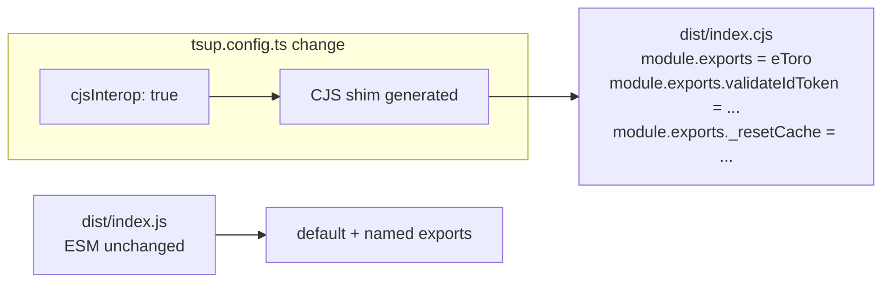

## Problem Statement

The CJS build (`dist/index.cjs`) emits the default export as `exports.default = eToro` alongside named exports (`exports.validateIdToken`, `exports._resetCache`). This means CJS consumers must use `require('authjs-etoro').default` instead of the expected `require('authjs-etoro')`.

Build output currently shows:
```
Entry module "dist/index.cjs" is using named and default exports together.
Consumers of your bundle will have to use `chunk.default` to access the default export,
which may not be what you want.
```

Verified: `node -e "const pkg = require('./dist/index.cjs'); typeof pkg"` → `object`, not `function`.

## User Story

As a developer using CommonJS (e.g., legacy Node.js project, older Next.js config files), I want `const eToro = require('authjs-etoro')` to return the provider function directly, so that I can use the library without knowing about the `.default` workaround.

## How It Was Found

Running `npm run build` shows a tsup/rollup warning about mixed named and default exports in the CJS bundle. Confirmed by requiring the built CJS file and checking the return type.

## Proposed Fix

Add `cjsInterop: true` to `tsup.config.ts`. This generates a CJS compatibility shim that correctly maps `module.exports` to the default export while still making named exports available via `module.exports.validateIdToken`, etc.

## Acceptance Criteria

- [ ] `npm run build` produces no CJS interop warnings
- [ ] `node -e "const eToro = require('./dist/index.cjs'); console.log(typeof eToro)"` prints `function`
- [ ] `node -e "const { validateIdToken } = require('./dist/index.cjs'); console.log(typeof validateIdToken)"` prints `function`
- [ ] `node -e "const { _resetCache } = require('./dist/index.cjs'); console.log(typeof _resetCache)"` prints `function`
- [ ] ESM import behavior is unchanged: `import eToro from 'authjs-etoro'` still works
- [ ] ESM named imports still work: `import { validateIdToken, _resetCache } from 'authjs-etoro'`
- [ ] All existing tests still pass with 100% coverage
- [ ] `npm pack --dry-run` tarball is still clean

## Verification

- Run `npm run build` — no warnings
- Run CJS import checks listed in acceptance criteria
- Run `npm run test:coverage` — all tests pass, 100% coverage maintained

## Out of Scope

- Changing the public API surface
- Changing the ESM build
- Adding new tests for CJS (manual verification is sufficient since tsup handles the shim)

---

## Planning

### Overview

Single-file config change: add `cjsInterop: true` to `tsup.config.ts`. tsup already has `splitting: true`, which when combined with `cjsInterop` generates a CJS shim that re-exports `module.exports = chunk.default` with named exports spread on top.

### Research Notes

- tsup's `cjsInterop` option (merged Aug 2023, improved Feb 2025) transforms the CJS output so `module.exports` is assigned the default export function directly, rather than wrapping it in `{ default: fn }`.
- Works reliably when `splitting: true` is also enabled (our config already has this).
- Source: [tsup PR #947](https://github.com/egoist/tsup/pull/947), [tsup PR #1310](https://github.com/egoist/tsup/pull/1310)
- Fallback if `cjsInterop` doesn't work with mixed exports: use a manual CJS entry shim or `onSuccess` post-build script.

### Assumptions

- tsup >= 8.0.0 supports `cjsInterop` (we're on `^8.0.0` ✓)
- `splitting: true` is already set in our config ✓

### Architecture Diagram



### One-Week Decision

**YES** — This is a 1-line config change with manual verification. Completes in < 1 hour.

### Implementation Plan

1. Add `cjsInterop: true` to `tsup.config.ts`
2. Run `npm run build` — verify no warnings
3. Verify CJS: `node -e "const eToro = require('./dist/index.cjs'); console.log(typeof eToro)"` → `function`
4. Verify named CJS: `node -e "const { validateIdToken } = require('./dist/index.cjs'); console.log(typeof validateIdToken)"` → `function`
5. Run `npm run test:coverage` — all tests pass, 100% coverage
6. Run `npm pack --dry-run` — tarball clean
