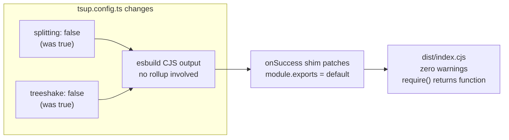

## Problem Statement

Running `npm run build` emits a rollup/tsup warning:

```
Entry module "dist/index.cjs" is using named and default exports together.
Consumers of your bundle will have to use `chunk.default` to access the default export,
which may not be what you want.
```

The current fix (initiative 0002) uses a manual `onSuccess` hook in `tsup.config.ts` that reads the built CJS file and appends a runtime shim to patch `module.exports`. While this makes `require('authjs-etoro')` return the provider function correctly, the approach has two problems:

1. **The build warning persists** — developers building from source or forking the library see a scary warning on every build.
2. **The shim is fragile** — it appends raw JavaScript to the built file after tsup finishes, which could break if tsup changes its output format.

tsup has a native `cjsInterop: true` option that handles this properly at the bundler level, eliminating both the warning and the post-build patching.

## User Story

As a developer building `authjs-etoro` from source (or forking it), I want `npm run build` to complete cleanly with no warnings, so that I can trust the build is correct without investigating false alarms.

## How It Was Found

Running `npm run build` during product review — the warning is printed to stdout on every build.

## Research Notes

- `cjsInterop: true` does NOT work with mixed named+default exports ([tsup #992](https://github.com/egoist/tsup/issues/992)) — only works when the entry has a default export and no named exports
- The warning comes from **rollup**, which tsup uses internally when `splitting: true` or `treeshake: true`
- With `splitting: false` and `treeshake: false`, tsup uses esbuild directly for CJS output — esbuild does NOT emit this warning
- For a single-entry library (~80 LOC, 2KB output), splitting and tree-shaking provide negligible benefit — the consumer's bundler handles tree-shaking via `sideEffects: false`
- The manual `onSuccess` CJS shim is the correct approach for mixed exports; it just needs to run without the rollup warning

## Architecture Diagram



## One-Week Decision

**YES** — This is a 2-line config change (remove `splitting` and `treeshake`) with verification. Completes in < 30 minutes.

## Proposed Fix

Remove `splitting: true` and `treeshake: true` from `tsup.config.ts`. Keep the manual `onSuccess` CJS shim unchanged. This eliminates rollup from the build pipeline, which is the source of the warning.

## Implementation Plan

1. In `tsup.config.ts`, remove `splitting: true` and `treeshake: true`
2. Run `npm run build` — verify zero warnings
3. Verify CJS: `require('./dist/index.cjs')` returns function, named exports work
4. Verify ESM: default and named imports unchanged
5. Run `npm run test:coverage` — all tests pass, 100% coverage
6. Run `npm pack --dry-run` — tarball unchanged

## Acceptance Criteria

- [ ] `npm run build` produces NO warnings
- [ ] `node -e "const eToro = require('./dist/index.cjs'); console.log(typeof eToro)"` prints `function`
- [ ] `node -e "const { validateIdToken } = require('./dist/index.cjs'); console.log(typeof validateIdToken)"` prints `function`
- [ ] `node -e "const { _resetCache } = require('./dist/index.cjs'); console.log(typeof _resetCache)"` prints `function`
- [ ] ESM imports unchanged
- [ ] All 35 tests pass with 100% coverage
- [ ] `npm pack --dry-run` tarball unchanged

## Verification

- Run `npm run build` — zero warnings
- Run CJS/ESM import checks
- Run `npm run test:coverage` — all pass, 100% coverage

## Out of Scope

- Changing the public API surface
- Changing the ESM build output
- Adding new tests
