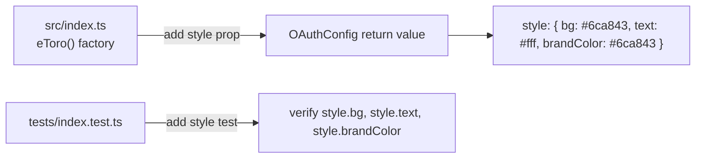

## Problem Statement

The `eToro()` provider factory returns an `OAuthConfig` without a `style` property. Every built-in Auth.js provider (GitHub, Google, Discord, Twitter, etc.) includes a `style` object that provides branding for the default sign-in page. Without it, the "Sign in with eToro" button renders as a plain, unbranded button with no color or logo — making the integration look incomplete out of the box.

Observed by inspecting the provider output:
```
Provider keys: authorization, checks, id, name, options, profile, token, type, userinfo
```
No `style` key present.

Built-in providers all include `style`:
- GitHub: `style: { bg: "#24292f", text: "#fff" }`
- Twitter: `style: { bg: "#1da1f2", text: "#fff" }`
- WorkOS: `style: { bg: "#6363f1", text: "#fff" }`
- Vipps: `style: { brandColor: "#f05c18" }`

## User Story

As a developer using Auth.js's default sign-in page, I want the eToro button to render with proper eToro branding (green color, white text), so that the sign-in page looks polished without custom CSS.

## How It Was Found

Product review: inspected the provider output object and compared against built-in Auth.js providers. All built-in providers include a `style` property; `authjs-etoro` does not.

## Proposed UX

Add a `style` object to the provider config with eToro's brand green (#6ca843) and white text:

```ts
style: {
  bg: "#6ca843",
  text: "#fff",
  brandColor: "#6ca843",
}
```

The `OAuthProviderButtonStyles` type from `@auth/core/providers/oauth` supports: `logo?: string`, `text?: string` (deprecated), `bg?: string` (deprecated, use brandColor), `brandColor?: string`.

## Acceptance Criteria

- [ ] Provider config includes `style` property with `bg`, `text`, and `brandColor`
- [ ] `style.bg` is `"#6ca843"` (eToro brand green)
- [ ] `style.text` is `"#fff"`
- [ ] `style.brandColor` is `"#6ca843"`
- [ ] New test verifies the `style` property exists and has correct values
- [ ] All existing tests still pass with 100% coverage
- [ ] `npm run build` still produces zero warnings

## Verification

- Run `npm run test:coverage` — all tests pass, 100% coverage maintained
- Inspect provider output to confirm `style` key is present

## Out of Scope

- Adding an SVG logo (eToro logo requires brand approval; colors are sufficient)
- Customizing the sign-in page layout
- Adding dark mode variants

---

## Planning

### Overview

Add a `style` property to the object returned by `eToro()` in `src/index.ts`. This is a single property addition that aligns the provider with every built-in Auth.js provider. The `OAuthProviderButtonStyles` interface from `@auth/core/providers/oauth` defines the shape: `logo?: string`, `text?: string`, `bg?: string`, `brandColor?: string`.

### Research Notes

- Every built-in Auth.js provider includes a `style` object (confirmed by grepping `node_modules/@auth/core/providers/*.js`)
- The `OAuthProviderButtonStyles` interface is defined in `@auth/core/providers/oauth.d.ts`
- `bg` and `text` are deprecated in favor of `brandColor`, but most built-in providers still set all three for backward compatibility
- eToro's primary brand green: `#6ca843` (from eToro brand guidelines)
- The `style` property is already part of `OAuthConfig` — no type changes needed
- Auth.js uses `style` to render branded buttons on the default sign-in page (`/api/auth/signin`)

### Assumptions

- eToro brand green `#6ca843` with white text provides sufficient contrast and recognizability
- No SVG logo is needed for initial release (would require brand approval)

### Architecture Diagram



### One-Week Decision

**YES** — This is a 3-line code change + 1 test. Completes in < 30 minutes.

### Implementation Plan

1. In `src/index.ts`, add `style: { bg: "#6ca843", text: "#fff", brandColor: "#6ca843" }` to the returned config object
2. In `tests/index.test.ts`, add a test that verifies the `style` property has the correct values
3. Run `npm run test:coverage` — all tests pass, 100% coverage
4. Run `npm run build` — zero warnings
