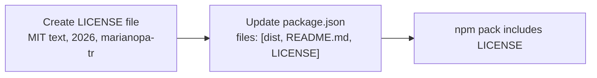

## Problem Statement

The `package.json` declares `"license": "MIT"` but the project has no `LICENSE` file. This means:
- The npm tarball ships without a license file (confirmed via `npm pack --dry-run`)
- Enterprise license auditing tools (FOSSA, Snyk, WhiteSource) may flag the package as "license unclear"
- GitHub does not display a license badge on the repository
- The companion packages (`passport-etoro`, `better-auth-etoro`) likely include LICENSE files, making this package inconsistent

## User Story

As a developer evaluating `authjs-etoro` for my company's project, I want to see a LICENSE file in the repository and npm package, so that I can confirm the licensing terms and pass our legal team's open-source audit.

## How It Was Found

Product review: `npm pack --dry-run` shows no LICENSE file in the tarball. `ls -la` confirms no LICENSE file exists in the project root. The `package.json` `files` field (`["dist", "README.md"]`) does not include `LICENSE`.

## Proposed UX

Add a standard MIT LICENSE file to the project root with the correct year and copyright holder. Update `package.json` `files` field to include `LICENSE` so it ships in the npm tarball.

## Acceptance Criteria

- [ ] `LICENSE` file exists in project root with MIT license text
- [ ] `package.json` `files` field includes `"LICENSE"`
- [ ] `npm pack --dry-run` shows `LICENSE` in the tarball contents
- [ ] All existing tests still pass with 100% coverage
- [ ] Build still produces zero warnings

## Verification

- Run `npm pack --dry-run` — LICENSE appears in tarball
- Run `npm run test:coverage` — all tests pass, 100% coverage maintained

## Out of Scope

- Changing the license type
- Adding license headers to source files

---

## Planning

### Overview

Add a standard MIT LICENSE file to the project root and include it in the npm tarball. This is a 2-file change: create `LICENSE` and update `package.json` `files` field.

### Research Notes

- npm recommends including a LICENSE file in every published package
- The MIT license text is standardized — use the OSI-approved template
- `package.json` `files` field currently includes `["dist", "README.md"]` — must add `"LICENSE"`
- npm automatically includes `LICENSE` (any case/extension) if present, even without listing in `files`. However, being explicit is better practice.
- Copyright holder should match `package.json` `author` field: `marianopa-tr`
- Year should be 2026 (current year)

### Assumptions

- The MIT license is the correct license (matches `package.json`)
- Copyright holder is `marianopa-tr` (matches `package.json` author)

### Architecture Diagram

### One-Week Decision

**YES** — This is a 2-file change that takes < 15 minutes.

### Implementation Plan

1. Create `LICENSE` file with MIT license text (year 2026, author `marianopa-tr`)
2. Update `package.json` `files` field to include `"LICENSE"`
3. Verify: `npm pack --dry-run` shows LICENSE in tarball
4. Verify: all tests still pass
