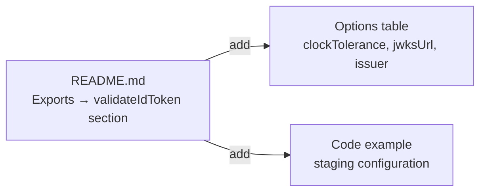

## Problem Statement

The README documents `validateIdToken(idToken, clientId, options?)` as a "Standalone JWKS-validated id_token decoder" but never documents what `options` accepts. The third parameter supports three useful overrides:

- `clockTolerance?: number` — seconds of tolerance for token expiration (default: 120)
- `jwksUrl?: string` — custom JWKS URL (default: `https://www.etoro.com/.well-known/jwks.json`)
- `issuer?: string` — expected issuer claim (default: `https://www.etoro.com`)

These are important for developers who need to:
- Test against eToro staging environments (different JWKS URL and issuer)
- Adjust clock tolerance for deployment environments with clock skew
- Use the standalone validator outside of Auth.js

Without this documentation, developers must read the source code to discover these options.

## User Story

As a developer using `validateIdToken` directly for a custom auth flow against eToro's staging environment, I want to know what options are available (custom JWKS URL, issuer, clock tolerance), so that I can configure the validator without reading the source code.

## How It Was Found

Product review: compared the README documentation against the actual `validateIdToken` function signature in `src/validate.ts`. The `options` parameter shape is not documented anywhere in the README.

## Proposed UX

Add an "Advanced Usage" or "Options" subsection under the `validateIdToken` entry in the README's Exports section. Show the options type and a code example using a staging configuration.

## Acceptance Criteria

- [ ] README documents the `options` parameter shape for `validateIdToken`
- [ ] README includes example usage with custom `jwksUrl` and `issuer` (staging scenario)
- [ ] README mentions default values for `clockTolerance` (120s), `jwksUrl`, and `issuer`
- [ ] No changes to source code or tests (documentation-only change)
- [ ] All existing tests still pass

## Verification

- Read the README and confirm options are documented
- Run `npm run test:coverage` — all tests pass, 100% coverage maintained

## Out of Scope

- Adding new functionality to `validateIdToken`
- Adding JSDoc changes (JSDoc already documents the function adequately)
- Generating API docs from source

---

## Planning

### Overview

Add documentation for the `validateIdToken` third parameter (`options`) to the README. This is a single-file change to `README.md` — no source code changes needed.

### Research Notes

- The `options` parameter in `src/validate.ts` has this shape:
  ```ts
  options?: {
    clockTolerance?: number;  // default: 120 seconds
    jwksUrl?: string;         // default: https://www.etoro.com/.well-known/jwks.json
    issuer?: string;          // default: https://www.etoro.com
  }
  ```
- Common use case: testing against eToro staging environments with different JWKS URLs
- The JSDoc on the function is comprehensive but README readers won't see it

### Assumptions

- The README's "Exports" section is the right place for this documentation
- A code example with staging config is the clearest way to document the options

### Architecture Diagram



### One-Week Decision

**YES** — This is a README-only change that takes < 15 minutes.

### Implementation Plan

1. In `README.md`, expand the `validateIdToken` entry in the Exports section
2. Add an options table showing parameter name, type, default, and description
3. Add a code example showing usage with a custom staging configuration
4. Verify: `npm run test:coverage` still passes (no code changes)
