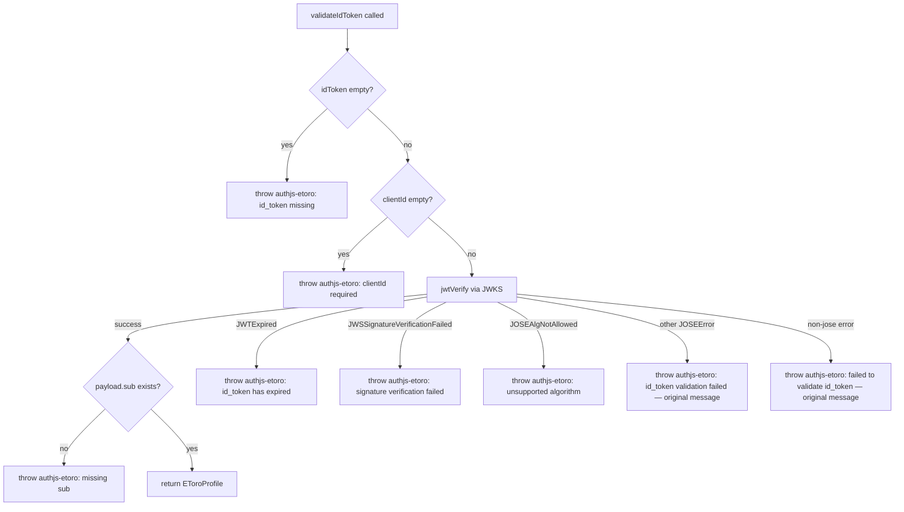

# Wrap jose errors with library-prefixed messages

## Problem statement

When `jwtVerify` from jose throws (malformed token, expired token, wrong issuer/audience, bad signature, JWKS fetch failure), the raw jose error propagates to the developer without any mention of `authjs-etoro`. In an Auth.js app with multiple providers, the developer sees errors like:

- `JWSInvalid: Invalid Compact JWS`
- `JWSSignatureVerificationFailed: signature verification failed`
- `JWTExpired: "exp" claim timestamp check failed`
- `JWTClaimValidationFailed: "iss" claim check failed`

None of these mention `authjs-etoro`, making it impossible to tell which provider threw the error. The library's own guards (empty token, empty clientId, missing sub) correctly use the `authjs-etoro:` prefix, but the jose-level errors don't.

## User story

As a developer using Auth.js with multiple providers (GitHub, Google, eToro), I want error messages from the eToro provider to be clearly attributed to `authjs-etoro` so that when token validation fails, I can immediately identify which provider is the source of the error.

## How it was found

Tested error paths by passing garbage tokens, malformed JWTs, and structurally-valid-but-unsigned tokens to the CJS and ESM builds:

```
node -e "require('./dist/index.cjs').validateIdToken('not-a-jwt', 'client').catch(e => console.log(e.constructor.name, '-', e.message))"
# Output: JWSInvalid - Invalid Compact JWS
# Expected: Error - authjs-etoro: invalid id_token — Invalid Compact JWS
```

## Proposed UX

All errors thrown by `validateIdToken` should be prefixed with `authjs-etoro:` and include the original jose error as `cause`:

| Scenario | Current error | Proposed error |
|----------|--------------|----------------|
| Garbage token | `JWSInvalid: Invalid Compact JWS` | `authjs-etoro: invalid id_token — Invalid Compact JWS` |
| Bad signature | `JWSSignatureVerificationFailed: signature verification failed` | `authjs-etoro: id_token signature verification failed` |
| Expired token | `JWTExpired: "exp" claim timestamp check failed` | `authjs-etoro: id_token has expired` |
| Wrong issuer | `JWTClaimValidationFailed: "iss" claim check failed` | `authjs-etoro: id_token validation failed — "iss" claim check failed` |
| JWKS fetch error | `TypeError: fetch failed` | `authjs-etoro: failed to validate id_token — fetch failed` |

Original error preserved via `cause` for programmatic access.

## Acceptance criteria

- [ ] All errors from `validateIdToken` start with `authjs-etoro:`
- [ ] Original jose error is preserved as `cause` on the thrown error
- [ ] Tests cover malformed token, bad signature, expired token, wrong issuer, wrong audience error messages
- [ ] Existing tests for error-throwing behavior still pass
- [ ] 100% branch coverage maintained

## Verification

- Run `npm test` — all tests pass
- Run `npm run test:coverage` — 100% branch coverage
- Manual check: `node -e "require('./dist/index.cjs').validateIdToken('not-a-jwt', 'client').catch(e => console.log(e.message))"` outputs message starting with `authjs-etoro:`

## Out of scope

- Changing the error types thrown (they should all be plain `Error` instances)
- Adding error codes or error subclasses
- Changing the behavior of `userinfo.request` error for missing id_token (already correctly prefixed)

---

## Planning

### Overview

Add a try/catch wrapper around the `jwtVerify` call in `validateIdToken` (`src/validate.ts`) to catch jose errors and re-throw them with `authjs-etoro:` prefixed messages, preserving the original error as `cause`. Update existing tests to assert on the wrapped messages and add tests for previously untested error paths (malformed tokens).

### Research notes

- jose v6 exports all error classes under `errors` namespace: `JWSInvalid`, `JWSSignatureVerificationFailed`, `JWTExpired`, `JWTClaimValidationFailed`, `JWKSNoMatchingKey`, `JWKSTimeout`, `JOSEAlgNotAllowed`, etc.
- All jose errors extend `errors.JOSEError`, which extends `Error`.
- The `Error` constructor accepts `{ cause }` option (ES2022, Node 16.9+) — our target is Node >=18 so this is safe.
- Auth.js logs provider errors during the userinfo phase; having `authjs-etoro:` in the message is the primary developer signal.

### Assumptions

- We wrap ALL errors from `jwtVerify` uniformly (both JOSEError subclasses and unexpected errors).
- We use specific messages for well-known jose error types (expired, signature failure) and a generic fallback for others.
- The `cause` property on the thrown Error preserves the original jose error for programmatic access.

### Architecture diagram



### One-week decision

**YES** — This is a ~2-hour task: one file change (`src/validate.ts`), plus test updates in `tests/validate.test.ts`. No new dependencies, no API changes, no breaking changes.

### Implementation plan

**Phase 1: Update `src/validate.ts`**
1. Import `errors` from jose
2. Wrap `jwtVerify` call in try/catch
3. In catch: check error type against known jose error classes
4. Re-throw new `Error` with `authjs-etoro:` prefix and `{ cause: originalError }`

**Phase 2: Update tests**
1. Update existing error-throwing tests to assert the wrapped message starts with `authjs-etoro:`
2. Add test for malformed/garbage token input
3. Add test verifying `cause` is preserved on thrown errors
4. Ensure 100% branch coverage is maintained
